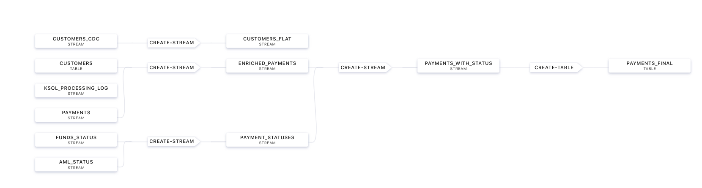

# Finacial services case: Payment Status check

We are going to build data pipeline which should look like this:



Data for this use case is loaded via 3 Connectors. Please check.
We will create a CDC Conenctor and doing event stream processing, enrichment and more... \
Start implementing: Login to ksqlcli
```bash
docker exec -it workshop-ksqldb-cli ksql http://ksqldb-server:8088
ksql> show topics;
ksql> show streams;
```
We can also quickly investigate some data:
```bash
ksql> print 'Payment_Instruction';
```
to see new incoming events or limit to 3 records
```bash
ksql> print 'Payment_Instruction' from beginning limit 3;
```
Check the properties set for ksqlDB. What is the `ksql.service.id`?
```bash
ksql> show properties;
```
Create Payment Stream and convert it automatically to AVRO.
```bash
create stream payments( 
    PAYMENT_ID INTEGER KEY, 
    CUSTID INTEGER, 
    ACCOUNTID INTEGER, 
    AMOUNT BIGINT, 
    BANK VARCHAR 
    ) with ( 
        kafka_topic='Payment_Instruction', 
        value_format='avro');
```
Check your creation with describe and select. You can also use Confluent Control Center for this inspection.
```bash
ksql> describe payments;
ksql> set 'auto.offset.reset'='earliest';
ksql> select * from payments emit changes;
```
Create the other streams
```bash
create stream aml_status ( 
  PAYMENT_ID INTEGER KEY,  
  BANK VARCHAR, 
  STATUS VARCHAR 
  ) with ( 
    kafka_topic='AML_Status', 
    value_format='avro');
```
```bash
create stream funds_status (
  PAYMENT_ID INTEGER KEY,
  REASON_CODE VARCHAR, 
  STATUS VARCHAR 
  ) with ( 
    kafka_topic='Funds_Status', 
     value_format='avro');
```
```bash
ksql> list streams;
ksql> exit
```
Inspect mysql database content:
```bash
docker exec -it workshop-mysql mysql -uroot -pconfluent
mysql> use demo;
mysql> show tables;
mysql> select * from CUSTOMERS;
mysql> exit
```
Create the DB CDC connector to get all data from database. We create the connector as script in ksqlDB:
```bash
docker exec -it workshop-ksqldb-cli ksql http://ksqldb-server:8088
CREATE SOURCE CONNECTOR source_dbz_mysql WITH (
          'connector.class' = 'io.debezium.connector.mysql.MySqlConnector',
          'database.hostname' = 'mysql',
          'database.port' = '3306',
          'database.user' = 'debezium',
          'database.password' = 'dbzpass',
          'database.server.id' = '42',
          'snapshot.mode' = 'when_needed',
          'database.allowPublicKeyRetrieval' = 'true',
          'database.server.name' = 'workshop',
          'table.whitelist' = 'demo.*',
          'database.history.kafka.bootstrap.servers' = 'kafka:29092',
          'database.history.kafka.topic' = 'dbhistory.demo' ,
          'include.schema.changes' = 'true',
          'transforms' =  'addTopicSuffix',
          'transforms.addTopicSuffix.type' = 'org.apache.kafka.connect.transforms.RegexRouter',
          'transforms.addTopicSuffix.regex' = '(.*)',
          'transforms.addTopicSuffix.replacement' = '$1-cdc'
);
ksql> show connectors;
ksql> describe connector source_dbz_mysql;
ksql> print 'workshop.demo.CUSTOMERS-cdc' from beginning;
```
```bash
CREATE STREAM customers_cdc WITH (kafka_topic='workshop.demo.CUSTOMERS-cdc', value_format='avro');
```
```bash
ksql> describe customers_cdc;
ksql> exit
```
Check Schema Registry. What did the connector create:
```bash
curl http://localhost:8081/subjects | jq
# output
  % Total    % Received % Xferd  Average Speed   Time    Time     Time  Current
                                 Dload  Upload   Total   Spent    Left  Speed
100   126  100   126    0     0  10500      0 --:--:-- --:--:-- --:--:-- 10500
[
  "workshop.demo.CUSTOMERS-cdc-value",  # This guy was created by CDC connector
  "Funds_Status-value",
  "workshop-cdc-value",     # This guy was created by CDC connector
  "AML_Status-value",
  "Payment_Instruction-value"
]
```

Now check in Control Center:
1) that the connector "source_dbz_mysql" is created and running,
2) created a couple of topics (3) and 2 subjects
2) check in the ksqldb area the ksqldb flow before you create next streams as running queries. We have a couple of streams running.

Reformat and filter out only relevant data from "customers_cdc" stream into a new stream "customers_flat"
```bash
docker exec -it workshop-ksqldb-cli ksql http://ksqldb-server:8088

ksql> set 'auto.offset.reset'='earliest';
```
```bash
create stream customers_flat with (partitions=1) as 
select after->id as id, 
       after->first_name as first_name, 
       after->last_name as last_name, 
       after->email as email, 
       after->gender as gender, 
       after->status360 as status360 
from customers_cdc 
partition by after->id; 
```
```bash
ksql> describe customers_flat;
```
Create Table CUSTOMERS which is based on the newly created topic CUSTOMERS_FLAT (by stream CUSTOMERS_FLAT)

```bash
CREATE TABLE customers ( 
  ID INTEGER PRIMARY KEY, 
  FIRST_NAME VARCHAR, 
  LAST_NAME VARCHAR, 
  EMAIL VARCHAR, 
  GENDER VARCHAR, 
  STATUS360 VARCHAR 
   ) WITH (
    kafka_topic='CUSTOMERS_FLAT',
    value_format='avro');
```
check streams and see which topics belong to them
```bash
ksql> list streams;
```
Topic CUSTOMERS_FLAT belongs to Stream CUSTOMERS_FLAT

```bash
ksql> list tables;
```
Table CUSTOMERS is based on the topic CUSTOMERS_FLAT

Check topology of execution stream CUSTOMERS_FLAT. Is the stream re-partitioned?

```bash
ksql> show queries;
```
Get de Query ID from the running queries 
```bash
ksql> explain CSAS_CUSTOMERS_FLAT_9;
```
Select new table with push query:
```bash
ksql> select * from customers emit changes;
ksql> select * from customers where id=1 emit changes;
```
**Open a new terminal**
```bash
ssh ec2-user@publicip
```
In the new terminal change data in DB and check how is update changing Kafka:
```bash
docker exec -it workshop-mysql mysql -uroot -pconfluent
mysql> use demo;
mysql> update CUSTOMERS set first_name = 'John', last_name='Smith', gender='Male' where id = 1;
mysql> exit;
```
Close the terminal.

In the other terminal check in ksql what happened...

Enriching Payments with Customer details

```bash
create stream enriched_payments as select 
  p.payment_id as payment_id,
  p.custid as customer_id,
  p.accountid, 
  p.amount, 
  p.bank, 
  c.first_name, 
  c.last_name, 
  c.email, 
  c.status360 
  from payments p 
  left join customers c on p.custid = c.id; 

ksql> describe ENRICHED_PAYMENTS;


ksql> select * from enriched_payments emit changes;
```
Now check in Control Center:
1) check in the ksqldb area - the running queries. Take a look in the details (SINK: and SOURCE:) of the running queries.
2) check in the ksqldb area the ksqldb flow to follow the expansion easier. If it is not visible refresh the webpage in browser.

Combining the status streams
```bash
CREATE STREAM payment_statuses 
  AS SELECT 
    payment_id, 
    status, 
    'AML' as source_system 
  FROM aml_status;
```
```bash
INSERT INTO payment_statuses 
  SELECT 
  payment_id, 
  status, 
  'FUNDS' as source_system 
FROM funds_status;
```
```bash
ksql> describe payment_statuses;
ksql> select * from payment_statuses emit changes;
```
Combine payment and status events in 1 hour window. **Why we need a timing window for stream-stream join?**

```bash
CREATE STREAM payments_with_status 
AS SELECT 
  ep.payment_id as payment_id, 
  ep.accountid,
  ep.amount, 
  ep.bank, 
  ep.first_name, 
  ep.last_name, 
  ep.email, 
  ep.status360, 
  ps.status, 
  ps.source_system 
FROM enriched_payments ep 
  LEFT JOIN payment_statuses ps WITHIN 1 HOUR ON ep.payment_id = ps.payment_id ;
```
```bash
ksql> describe payments_with_status;
ksql> select * from payments_with_status emit changes;
ksql> select * from payments_with_status emit changes limit 10;
```
Check in the ksqldb area the ksqldb flow to follow the expansion easier

Aggregate into consolidated records

```bash
CREATE TABLE payments_final AS SELECT 
  payment_id, 
  histogram(status) as status_counts, 
  collect_list('{ "system" : "' + source_system + '", "status" : "' + STATUS + '"}') as service_status_list 
  from payments_with_status 
  where status is not null 
  group by payment_id;
```
```bash
  
ksql> describe PAYMENTS_FINAL ;
ksql> select * from payments_final emit changes limit 1;
```
**Pull queries**, check value for a specific payment (snapshot lookup). 

```bash
ksql> select * from payments_final where payment_id=825636145;
ksql> exit;
```
**Lets try the REST API**

Query by REST Call

```bash
curl -X "POST" "http://localhost:8088/query" \
        -H "Content-Type: application/vnd.ksql.v1+json; charset=utf-8" \
        -d $'{"ksql": "select * from payments_final where payment_id=825636145;","streamsProperties": {}}' | jq
```
list streams via curl
```bash
curl -X "POST" "http://localhost:8088/ksql" \
     -H "Content-Type: application/vnd.ksql.v1+json; charset=utf-8" \
     -d $'{"ksql": "LIST STREAMS;","streamsProperties": {}}' | jq        
```

END Lab 1 


[go back to Agenda](https://github.com/jr-marquez/ksqldbWorkshop/blob/main/README.md#hands-on-agenda-and-labs)
