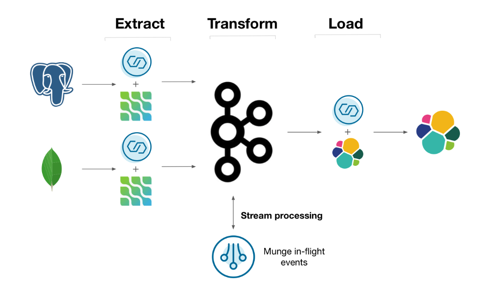

# Streaming ETL
The use case blueprint should look like this one:


**Open a new terminal using ssh ec2-user@publicip**
Check collections in mongoDB
```bash
docker exec -it mongo /bin/bash
mongo -u $MONGO_INITDB_ROOT_USERNAME -p mongo-pw admin
rs.initiate()
use logistics
show collections
 ```
Lets start loading Orders into our collections
```bash
cd /home/ec2-user/ksqldbWorkshop-main/docker
python loadOrders.py
 ```
 if you have problemas please use this instead
```bash
db.orders.insert({"customer_id": "2", "order_id": "13", "price": 50.50, "currency": "usd", "ts": "2020-04-03T11:20:00"})
db.orders.insert({"customer_id": "7", "order_id": "29", "price": 15.00, "currency": "aud", "ts": "2020-04-02T12:36:00"})
db.orders.insert({"customer_id": "5", "order_id": "17", "price": 25.25, "currency": "eur", "ts": "2020-04-02T17:22:00"})
db.orders.insert({"customer_id": "5", "order_id": "15", "price": 13.75, "currency": "usd", "ts": "2020-04-03T02:55:00"})
db.orders.insert({"customer_id": "7", "order_id": "22", "price": 29.71, "currency": "aud", "ts": "2020-04-04T00:12:00"})
```
Lets start running ksqldb commands
```bash 
docker exec -it workshop-ksqldb-cli ksql http://ksqldb-server:8088
ksql> SET 'auto.offset.reset' = 'earliest';
```
Create source connector for Postgres, it has user information. you can do it from control center if you wish, give it a try.
```bash
CREATE SOURCE CONNECTOR users_reader WITH ( 
    'connector.class' = 'io.debezium.connector.postgresql.PostgresConnector', 
    'database.hostname' = 'postgres', 
    'database.port' = '5432', 
    'database.user' = 'postgres-user', 
    'database.password' = 'postgres-pw', 
    'database.dbname' = 'customers', 
    'database.server.name' = 'customers', 
    'table.whitelist' = 'public.users', 
    'transforms' = 'unwrap', 
    'transforms.unwrap.type' = 'io.debezium.transforms.ExtractNewRecordState', 
    'transforms.unwrap.drop.tombstones' = 'false', 
    'transforms.unwrap.delete.handling.mode' = 'rewrite' 
); 
```
Create another source conector to capture orders and shippments in real time
```bash
CREATE SOURCE CONNECTOR logistics_reader WITH ( 
    'connector.class' = 'io.debezium.connector.mongodb.MongoDbConnector', 
    'mongodb.hosts' = 'mongo:27017', 
    'mongodb.name' = 'my-replica-set', 
    'mongodb.authsource' = 'admin', 
    'mongodb.user' = 'dbz-user', 
    'mongodb.password' = 'dbz-pw', 
    'collection.whitelist' = 'logistics.*', 
    'transforms' = 'unwrap', 
    'transforms.unwrap.type' = 'io.debezium.connector.mongodb.transforms.ExtractNewDocumentState', 
    'transforms.unwrap.drop.tombstones' = 'false', 
    'transforms.unwrap.delete.handling.mode' = 'drop', 
    'transforms.unwrap.operation.header' = 'true' 
);
```
Check connect in control center if both connectors are up and running. 

Create a stream for all data comming in **Why am I doing this?**
```bash
CREATE STREAM users WITH ( 
    kafka_topic = 'customers.public.users', 
    value_format = 'avro' 
); 
```
```bash
CREATE STREAM orders WITH ( 
    kafka_topic = 'my-replica-set.logistics.orders', 
    value_format = 'avro', 
    timestamp = 'ts', 
    timestamp_format = 'yyyy-MM-dd''T''HH:mm:ss' 
); 
```
```bash
CREATE STREAM shipments WITH ( 
    kafka_topic = 'my-replica-set.logistics.shipments', 
    value_format = 'avro', 
    timestamp = 'ts', 
    timestamp_format = 'yyyy-MM-dd''T''HH:mm:ss' 
); 
```
Check ksqldb flow in control center , the ideal world is having a ksqldb app per use case. 

Lets create a materilized view of our users 
```bash
CREATE TABLE users_by_key AS 
    SELECT id, 
           latest_by_offset(name) AS name, 
           latest_by_offset(age) AS age 
    FROM users 
    GROUP BY id 
    EMIT CHANGES;
```
```bash
ksql> select * from users_by_key emit changes;
```
**Open a new ssh terminal** We are going to check how pull queries maintain latest value of an specific key

```bash
docker exec -it postgres /bin/bash
psql -U postgres-user customers
update users set age=99 where name='ramon';

exit
exit
```
check what happend in the ksqldb terminal, now lets see latest value of the pull query
```bash
ksql> select * from users_by_key where id='4';
```
lets do a left join to get who is ordering what
```bash
CREATE STREAM enriched_orders AS 
    SELECT o.order_id, 
           o.price, 
           o.currency, 
           c.id AS customer_id, 
           c.name AS customer_name, 
           c.age AS customer_age 
    FROM orders AS o 
    LEFT JOIN users_by_key c 
    ON o.customer_id = c.id 
    EMIT CHANGES; 
```
Now lets see where should the orders be shipped
```bash
CREATE STREAM shipped_orders WITH ( 
    kafka_topic = 'shipped_orders' 
)   AS 
    SELECT o.order_id, 
           s.shipment_id, 
           o.customer_id, 
           o.customer_name, 
           o.customer_age, 
           s.origin, 
           o.price, 
           o.currency 
    FROM enriched_orders AS o 
    INNER JOIN shipments s 
    WITHIN 7 DAYS 
    ON s.order_id = o.order_id 
    EMIT CHANGES;
```
Lets sink the data to ElasticSearch for full text query searches
```bash
CREATE SINK CONNECTOR enriched_writer WITH (
    'connector.class' = 'io.confluent.connect.elasticsearch.ElasticsearchSinkConnector',
    'connection.url' = 'http://elastic:9200',
    'type.name' = 'kafkaconnect',
    'topics' = 'shipped_orders'
);
exit
```
check that data is arriving
```bash
curl http://localhost:9200/shipped_orders/_search?pretty
```
End of lab 5

[go back to Agenda](https://github.com/jr-marquez/ksqldbWorkshop/blob/main/README.md#hands-on-agenda-and-labs)
