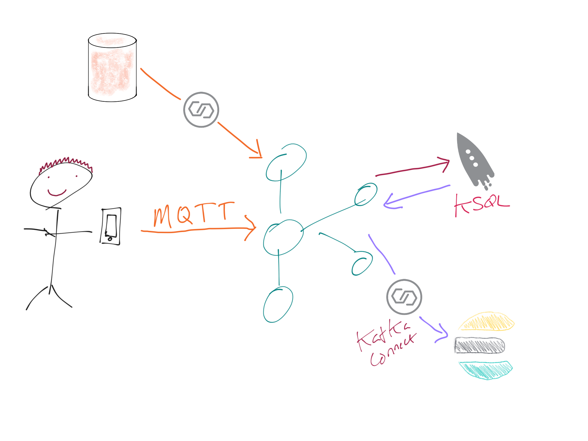
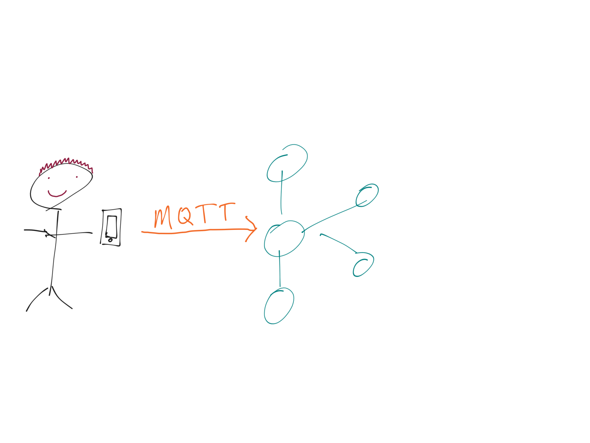
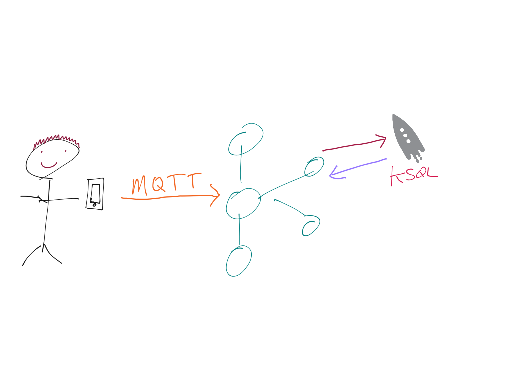
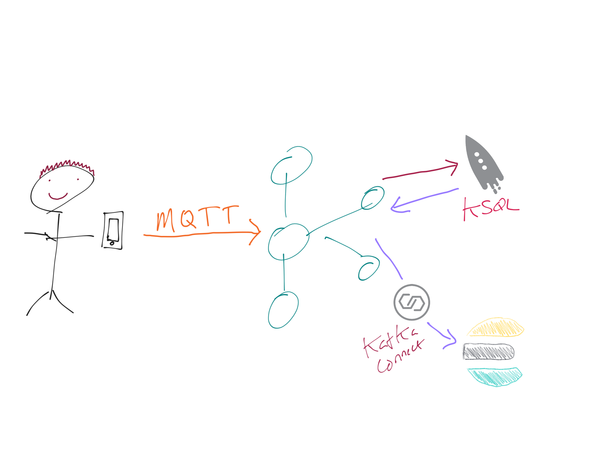
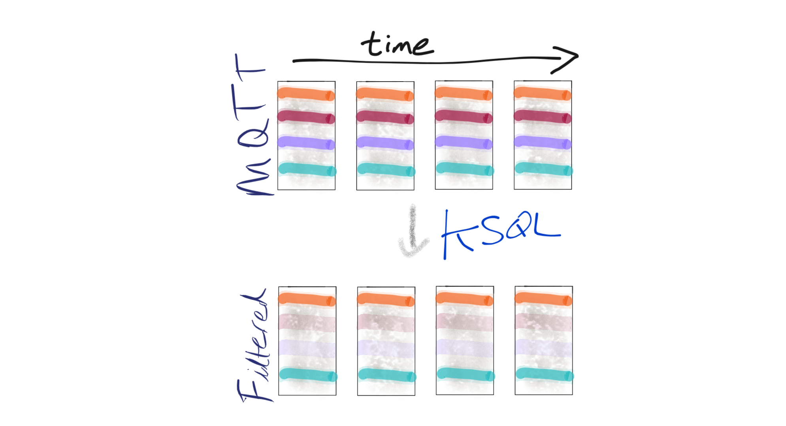
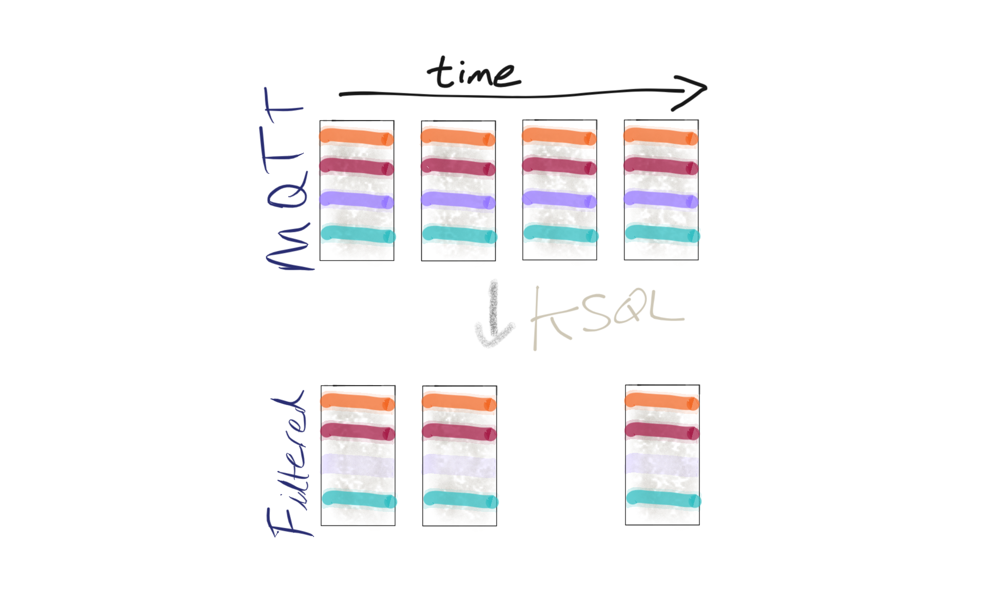

== Overview

=== Start

[source,bash]
----
cd /home/ec2-user/ksqldbWorkshop-main/docker
----

=== Data

load sample data from local

[source,bash]
----
kafkacat -b localhost:9092 -t data_mqtt -K: -P -T -l ./data/dummy_data.kcat
----

Check there's data on the topic: 

[source,bash]
----
kafkacat -b localhost:9092 -t data_mqtt -o beginning -C
----

=== Run KSQL CLI 

* KSQLDB CLI:

[source,bash]
----
docker exec -it workshop-ksqldb-cli ksql http://ksqldb-server:8088
----

== Demo

Check out the topics on the cluster

[source,sql]
----
SHOW TOPICS; 
----

There's a stream of MQTT data; let's take a look at it!

[source,sql]
----
SET 'auto.offset.reset' = 'earliest';
PRINT 'data_mqtt';
----

Let's take this stream of JSON messages and declare the schema so that we can use it in KSQL. The schema comes from the owner of the data: https://owntracks.org/booklet/tech/json/#_typelocation

[source,sql]
----
CREATE STREAM MQTT_RAW
    (WHO VARCHAR KEY, TID  VARCHAR, BATT INTEGER, LON       DOUBLE,  LAT  DOUBLE, 
     TST  BIGINT,  ALT  INTEGER, COG       INTEGER, VEL  INTEGER,
     P    DOUBLE,  BS   INTEGER, CONN      VARCHAR, ACC  INTEGER,
     T    VARCHAR, VAC  INTEGER, INREGIONS VARCHAR, TYPE VARCHAR) 
WITH (KAFKA_TOPIC = 'data_mqtt', VALUE_FORMAT='JSON');
----

[source,sql]
----
SELECT TIMESTAMPTOSTRING(TST*1000, 'MMM-dd HH:mm:ss','Europe/London') as TS,
       TID,
       BATT,
       BS
  FROM MQTT_RAW emit changes;
----
[source,sql]
----
SELECT TIMESTAMPTOSTRING(TST*1000, 'MMM-dd HH:mm:ss','Europe/London') as TS,
       TID,
       BATT,
       BS,
       GEO_DISTANCE(LAT,LON,51.4965005,-0.2106881,'KM') AS DISTANCE_FROM_VENUE
  FROM MQTT_RAW emit changes;
----
[source,sql]
----
SELECT who, SPLIT(WHO, '/')[3] AS WHO2 FROM MQTT_RAW EMIT CHANGES LIMIT 5;
----
[source,sql]
----
SELECT LAT, LON, CAST(LAT AS VARCHAR) + ',' + CAST(LON AS VARCHAR) AS LOCATION FROM MQTT_RAW EMIT CHANGES LIMIT 5;
----
[source,sql]
----
SELECT BS FROM MQTT_RAW EMIT CHANGES LIMIT 10;
----

https://owntracks.org/booklet/tech/json/#_typelocation[Per the documentation] there are some fields which have special meanings, such as the state of the battery: 

[source,sql]
----
SELECT BS, CASE WHEN BS=0 THEN 'Unknown' 
                   WHEN BS=1 THEN 'Unplugged'
                   WHEN BS=2 THEN 'Charging'
                   WHEN BS=3 THEN 'Full' 
                   ELSE '[unknown]'
              END AS BATTERY_STATUS, BATT FROM MQTT_RAW EMIT CHANGES LIMIT 10;
----

Now let's do something more than just write this to the screen. Let's write it to a new Kafka topic! 

[source,sql]
----
CREATE STREAM PHONE_DATA
    WITH (VALUE_FORMAT='AVRO') AS
    SELECT WHO,
            SPLIT(WHO, '/')[3] AS WHOSIMPLE
            , TST * 1000 AS EVENT_TIME_EPOCH_MS_TS
            , CASE WHEN LAT IS NULL OR LON IS NULL THEN CAST(NULL AS VARCHAR) 
            	   ELSE CAST(LAT AS VARCHAR) +','+CAST(LON AS VARCHAR) 
              END AS LOCATION
            , ACC AS LOCATION_ACCURACY_M
            , ALT AS ALTITUDE_M
            , BATT AS BATTERY_PCT
            , CASE WHEN BS=0 THEN 'Unknown' 
                   WHEN BS=1 THEN 'Unplugged'
                   WHEN BS=2 THEN 'Charging'
                   WHEN BS=3 THEN 'Full' 
                   ELSE '[unknown]'
              END AS BATTERY_STATUS
            , COG AS COURSE_OVER_GROUN
            , CASE WHEN T='p' THEN 'ping issued randomly by background task'
                   WHEN T='c' THEN 'circular region enter/leave event'
                   WHEN T='b' THEN 'beacon region enter/leave event'
                   WHEN T='r' THEN 'response to a reportLocation cmd message'
                   WHEN T='u' THEN 'manual publish requested by the user'
                   WHEN T='t' THEN 'timer based publish in move'
                   WHEN T='v' THEN 'updated by Settings/Privacy/Locations Services/System Services/Frequent Locations monitoring'
                   ELSE '[unknown]'
              END AS REPORT_TRIGGER
            , TID AS TRACKER_ID
            , VAC AS VERTICAL_ACCURACY_M
            , VEL AS VELOCITY_KMH
            , P AS PRESSURE_KPA
            , CASE WHEN CONN='w' THEN 'WiFI'
                   WHEN CONN='o' THEN 'Offline'
                   WHEN CONN='m' THEN 'Mobile'
                   ELSE '[unknown]'
              END AS CONNECTIVITY_STATUS
            , INREGIONS AS REGIONS
            , LAT, LON,
            GEO_DISTANCE(LAT,LON,51.4965005,-0.2106881,'KM') AS DISTANCE_FROM_VENUE
        FROM MQTT_RAW;
----

Show it worked: 

[source,sql]
----
SELECT WHOSIMPLE, 
       EVENT_TIME_EPOCH_MS_TS, 
       TRACKER_ID, 
       BATTERY_PCT, 
       BATTERY_STATUS,
       CONNECTIVITY_STATUS
  FROM PHONE_DATA emit changes; 
----

Since this is just a Kafka topic we can use and consume it just like any other. In this example, streaming the data to Elasticsearch.  Do it in ksqldb

[source,sql]
----
CREATE SINK CONNECTOR sink_elastic_phone_data_02 WITH (
  'connector.class' = 'io.confluent.connect.elasticsearch.ElasticsearchSinkConnector',
  'connection.url' = 'http://elasticsearch:9200',
  'type.name' = '',
  'behavior.on.malformed.documents' = 'warn',
  'errors.tolerance' = 'all',
  'errors.log.enable' = 'true',
  'errors.log.include.messages' = 'true',
  'topics.regex' = 'PHONE_.*',
  'key.ignore' = 'true',
  'schema.ignore' = 'true',
  'key.converter' = 'org.apache.kafka.connect.storage.StringConverter'
);

----

* Check it's running - exit ksqldb 
+
[source,bash]
----
curl -s "http://localhost:8083/connectors?expand=info&expand=status" | \
         jq '. | to_entries[] | [ .value.info.type, .key, .value.status.connector.state,.value.status.tasks[].state,.value.info.config."connector.class"]|join(":|:")' | \
         column -s : -t| sed 's/\"//g'| sort
----
+
[source,bash]
----
sink    |  sink-elastic-phone_data-00      |  RUNNING  |  RUNNING  |  io.confluent.connect.elasticsearch.ElasticsearchSinkConnector
----

* Set up Kibana
+
[source,bash]
----
echo -e "\n--\n+> Opt out of Kibana telemetry"
curl 'http://localhost:5601/api/telemetry/v2/optIn' -H 'kbn-xsrf: nevergonnagiveyouup' -H 'content-type: application/json' -H 'accept: application/json' --data-binary '{"enabled":false}' --compressed

echo -e "Import objects"
curl 'http://localhost:5601/api/saved_objects/_import?overwrite=true' -H 'Connection: keep-alive' -H 'Origin: http://localhost:5601' -H 'kbn-version: 7.5.0' --form file=@data/kibana.ndjson
----
We will need to create an index pattern in kibana 

* Go to the Kibana dashboard - <your lab ip>:5601

Check out the source data in MySQL:

[source,sql]
----
docker exec -it workshop-mysql mysql -uroot -pconfluent
----
[source,sql]
----
use demo
----

[source,sql]
----
SELECT USERID, EMAIL, SHARE_LOCATION_OPTIN FROM USERS; 
----

[source,sql]
----
+--------+------------------+----------------------+
| USERID | EMAIL            | SHARE_LOCATION_OPTIN |
+--------+------------------+----------------------+
| rmoff  | robin@rmoff.net  |                    1 |
| ivor   | ivor@example.com |                    0 |
| hugh   | hugh@example.com |                    0 |
+--------+------------------+----------------------+ 
----
exit mysql

Ingest the data into ksqlDB

[source,bash]
----
docker exec -it workshop-ksqldb-cli ksql http://ksqldb-server:8088

ksql> SET 'auto.offset.reset' = 'earliest';
----

[source,sql]
----
CREATE SOURCE CONNECTOR source_debezium_mysql_users_00 WITH (
  'connector.class' = 'io.debezium.connector.mysql.MySqlConnector',
  'database.hostname' = 'mysql',
  'database.port' = '3306',
  'database.user' = 'debezium',
  'database.password' = 'dbzpass',
  'database.server.id' = '42',
  'database.server.name' = 'workshop',
  'table.whitelist' = 'demo.USERS',
  'database.history.kafka.bootstrap.servers' = 'kafka:29092',
  'database.history.kafka.topic' = 'dbhistory.demo' ,
  'decimal.handling.mode' = 'double',
  'include.schema.changes' = 'true',
  'transforms' = 'unwrap,addTopicPrefix',
  'transforms.unwrap.type' = 'io.debezium.transforms.UnwrapFromEnvelope',
  'transforms.addTopicPrefix.type' = 'org.apache.kafka.connect.transforms.RegexRouter',
  'transforms.addTopicPrefix.regex' = '(.*)',
  'transforms.addTopicPrefix.replacement' = 'mysql2-$1'
);
----

Declare the KSQL table on the topic populated from the database: 

[source,sql]
----

CREATE STREAM USERS_STREAM_CDC WITH (KAFKA_TOPIC='mysql2-workshop.demo.USERS', VALUE_FORMAT='AVRO');

create stream USERS_STREAM with (partitions=1) as select USERID, 
       EMAIL,
       SHARE_LOCATION_OPTIN, 
       PRIVACY_LOCATION_LAT, 
       PRIVACY_LOCATION_LON, 
       PRIVACY_ZONE_KM,
       CREATE_TS,
       UPDATE_TS 
from USERS_STREAM_CDC 
partition by USERID; 

CREATE TABLE USERS (
  USERID VARCHAR PRIMARY KEY,
  EMAIL VARCHAR,
  SHARE_LOCATION_OPTIN BIGINT,
  PRIVACY_LOCATION_LAT DOUBLE,
  PRIVACY_LOCATION_LON DOUBLE,
  PRIVACY_ZONE_KM DOUBLE,
  CREATE_TS VARCHAR,
  UPDATE_TS VARCHAR

) WITH (KAFKA_TOPIC='USERS_STREAM', VALUE_FORMAT='AVRO'); 

----

Examine the data: 

[source,sql]
----

SELECT TIMESTAMPTOSTRING(R.ROWTIME, 'MMM-dd HH:mm:ss','Europe/London') AS TS,
       R.WHOSIMPLE, 
       U.EMAIL, 
       U.SHARE_LOCATION_OPTIN, 
       R.LAT,
       R.LON
    FROM PHONE_DATA R
           LEFT JOIN USERS U
           ON R.WHOSIMPLE = U.USERID EMIT CHANGES;
----

Open a new ssh terminal and run datagen

[source,bash]
----
cd /home/ec2-user/ksqldbWorkshop-main/docker
./run_datagen.sh
----

[source,sql]
----
SET 'auto.offset.reset' = 'latest';

SELECT  TIMESTAMPTOSTRING(R.ROWTIME, 'MMM-dd HH:mm:ss','Europe/London') AS TS,
         WHOSIMPLE
        ,U.EMAIL AS EMAIL
        ,CASE WHEN U.SHARE_LOCATION_OPTIN = 1 THEN LOCATION 
            ELSE CAST(NULL AS VARCHAR) 
          END AS LOCATION
  FROM PHONE_DATA R 
          LEFT JOIN USERS U 
          ON R.WHOSIMPLE = U.USERID
  WHERE WHOSIMPLE='ivor' emit changes;
----

In a new terminal, show MySQL with KSQL still visible.

[source,sql]
----
docker exec -it workshop-mysql mysql -uroot -pconfluent
----
[source,sql]
----
use demo
----

In MySQL make an update to a user's profile to switch their data optin; note how the KSQL query above changes in response to it. 

[source,sql]
----
UPDATE USERS SET SHARE_LOCATION_OPTIN=TRUE WHERE USERID='ivor';

UPDATE USERS SET SHARE_LOCATION_OPTIN=FALSE WHERE USERID='ivor';
----

Looking at the data in MySQL in more detail, we can see each user can optionally specify a _privacy zone_ within which their data won't be shared, but outside of which it can. 

[source,sql]
----
SELECT * FROM USERS WHERE USERID='rmoff' \G 
----

[source,sql]
----
*************************** 1. row ***************************
              USERID: rmoff
               EMAIL: robin@rmoff.net
SHARE_LOCATION_OPTIN: 1
PRIVACY_LOCATION_LAT: 53.924729
PRIVACY_LOCATION_LON: -1.804453
     PRIVACY_ZONE_KM: 1
           CREATE_TS: 2019-11-14 06:54:38
           UPDATE_TS: 2019-11-14 06:54:38
1 row in set (0.00 sec) 
----

We can apply this logic in the SQL as part of the streaming application: 

[source,sql]
----
SET 'auto.offset.reset' = 'earliest';

CREATE STREAM PHONE_LOCATION_OPTIN AS
  SELECT WHOSIMPLE,
         EVENT_TIME_EPOCH_MS_TS,
         CASE 
            WHEN U.SHARE_LOCATION_OPTIN = 1 THEN 
              CASE 
                WHEN GEO_DISTANCE (LAT,LON,U.PRIVACY_LOCATION_LAT,U.PRIVACY_LOCATION_LON,'KM') > U.PRIVACY_ZONE_KM 
                  THEN LOCATION 
                ELSE '<Private>'
              END
            WHEN U.SHARE_LOCATION_OPTIN = 0 THEN '<Opted out>'
            ELSE '<No user record>' 
         END AS LOCATION, 
         GEO_DISTANCE (LAT,LON,U.PRIVACY_LOCATION_LAT,U.PRIVACY_LOCATION_LON,'KM') AS DISTANCE_KM_FROM_PRIVACY_ZONE,
         U.PRIVACY_ZONE_KM AS PRIVACY_ZONE_THRESHOLD_KM,
         BATTERY_PCT,
         BATTERY_STATUS,
         U.EMAIL AS EMAIL
  FROM   PHONE_DATA R
         LEFT JOIN USERS U
         ON R.WHOSIMPLE = U.USERID;
----

[source,sql]
----
SELECT TIMESTAMPTOSTRING(ROWTIME, 'MMM-dd HH:mm:ss','Europe/London') AS TS,
       WHOSIMPLE,
       LOCATION,
       DISTANCE_KM_FROM_PRIVACY_ZONE,
       PRIVACY_ZONE_THRESHOLD_KM
  FROM PHONE_LOCATION_OPTIN
  WHERE WHOSIMPLE='rmoff' emit changes;
----

== MOAR derived streams

You can also use KSQL to create a subset of the data so that other teams could use the data

[source,sql]
----
SET 'auto.offset.reset' = 'earliest';

CREATE STREAM PHONE_BATTERY_DATA AS
  SELECT WHO, BATTERY_PCT, BATTERY_STATUS, CONNECTIVITY_STATUS 
    FROM PHONE_DATA;
----

== Back to basics

With a schema in place we can pick out fields from the data:

[source,sql]
----
SET 'auto.offset.reset' = 'earliest';
SELECT TIMESTAMPTOSTRING(ROWTIME, 'yyyy-MM-dd HH:mm:ss') as TS, WHO, BATT FROM MQTT_RAW emit changes;
----

[source,sql]
----
+-------------------------+-------------------------+-------------------------+
|TS                       |ROWKEY                   |BATT                     |
+-------------------------+-------------------------+-------------------------+
|2019-09-30 20:47:30      |owntracks/race-write/rife|45                       |
|2019-09-30 20:47:30      |owntracks/race-write/rmof|100                      |
|                         |f-                       |                         |
|2019-09-30 20:47:30      |owntracks/race-write/EF81|100                      |
|                         |CA0A-BBD6-4116-BBC7-38EE8|                         |
|                         |FA3D5A4                  |                         |
[…]
----

We can use predicates to filter the data:

[source,sql]
----
SELECT WHO, TST, BATT 
  FROM MQTT_RAW 
 WHERE WHO LIKE '%rmoff' emit changes;
----

[source,sql]
----
+-----------------------------+-------------+---------+
|ROWKEY                       |TST          |BATT     |
+-----------------------------+-------------+---------+
|owntracks/tiqmyral/rmoff     |1569316069   |97       |
|owntracks/tiqmyral/rmoff     |1569315063   |96       |
|owntracks/tiqmyral/rmoff     |1569312091   |95       |
----

Looking at the message key it's the final part of it that identifies the user, so let's extract that

[source,sql]
----
SELECT WHO, SPLIT(WHO, '/')[3] AS WHOSIMPLE 
  FROM MQTT_RAW emit changes
  LIMIT 5;
----

[source,sql]
----
SELECT BS FROM MQTT_RAW emit changes; 
----

[source,sql]
----
+--------+
|BS      |
+--------+
|1       |
|1       |
|1       |
|1       |
|1       | 
----

We can use KSQL to apply these values to the codes to make the data more useful. Check out the `AS` clause too for changing the schema field names.

[source,sql]
----
SELECT BS, 
        CASE WHEN BS=0 THEN 'Unknown' 
             WHEN BS=1 THEN 'Unplugged'
             WHEN BS=2 THEN 'Charging'
             WHEN BS=3 THEN 'Full' 
             ELSE '[unknown]'
        END AS BATTERY_STATUS, 
        BATT AS BATTERY_PCT
   FROM MQTT_RAW emit changes;
----

[source,sql]
----
+----------------------------+----------------------------+----------------------------+
|BS                          |BATTERY_STATUS              |BATT                        |
+----------------------------+----------------------------+----------------------------+
|1                           |Unplugged                   |45                          |
|1                           |Unplugged                   |45                          |
|3                           |Full                        |100                         |
|2                           |Charging                    |100                         |
|1                           |Unplugged                   |45                          |
|3                           |Full                        |100                         | 
----

link:https://github.com/jr-marquez/ksqldbWorkshop/blob/main/README.md#hands-on-agenda-and-labs[go back to Agenda]